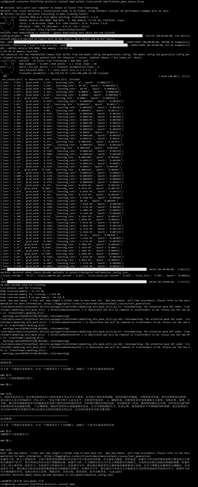
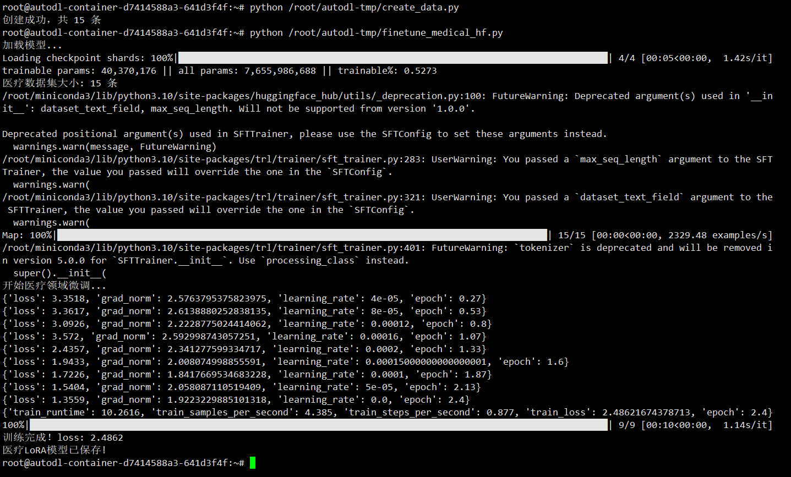

# 🔧 LLM 微调实操记录

## 为什么做这个实验

我在医疗AI项目（企业微信家医助手）中对比过豆包API和本地部署的Qwen模型，发现同样的Prompt在两个模型上效果差异很大，本地模型指令遵循能力明显偏弱。

为了理解这个差距从哪来、微调能改善多少，我用AutoDL搭建环境，跑通了完整的QLoRA微调流程。

---

## 实验一：Qwen2.5-7B SFT 指令微调（中文 Alpaca）

**日期**：2026-05-03  
**环境**：AutoDL RTX 4090（24GB）  
**框架**：Unsloth + HuggingFace TRL  

---

### 技术方案

| 项目 | 配置 |
|------|------|
| 基座模型 | Qwen2.5-7B-Instruct |
| 微调方法 | QLoRA（4bit 量化 + LoRA） |
| LoRA rank | 16 |
| LoRA alpha | 16 |
| 目标模块 | q_proj, k_proj, v_proj, o_proj, gate_proj, up_proj, down_proj |
| 数据集 | silk-road/alpaca-data-gpt4-chinese（52049 条中文指令数据） |
| 训练步数 | 60 steps |
| Batch size | 2（gradient_accumulation=4，有效 batch=8） |
| 学习率 | 2e-4（linear scheduler） |
| 优化器 | adamw_8bit |
| 精度 | bf16 |

---

### 训练结果

| 指标 | 数值 |
|------|------|
| 训练耗时 | 70.25 秒（1.17 分钟） |
| 平均 Loss | 1.483 |
| 峰值显存 | 11.371 GB |
| 训练用显存 | 5.978 GB |
| 显存使用率 | 48.35%（RTX 4090） |
| 训练速度 | 0.854 steps/s |
| 样本吞吐 | 6.833 samples/s |



---

### 简历描述

> 基于Unsloth框架对Qwen2.5-7B进行LoRA微调，使用中文Alpaca数据集（52049条），训练60步，loss 1.483，峰值显存11.37GB（24GB的48%），验证了QLoRA参数高效微调的完整流程。

---

### 关键技术点

1. **QLoRA 量化微调**：4bit NF4 量化加载 7B 模型，配合 LoRA 低秩适配器，仅训练 ~0.5% 参数量，显存占用不到 12GB
2. **Unsloth 加速**：相比原生 HuggingFace 训练速度提升 2x+，通过内核优化和梯度检查点（gradient checkpointing）实现
3. **中文指令数据**：使用 GPT-4 生成的中文 Alpaca 指令数据集，覆盖知识问答、文本生成、逻辑推理等多种任务类型
4. **Prompt 模板**：中文 Alpaca 格式（指令/输入/回答三段式），配合 EOS token 控制生成结束

### 训练脚本

脚本位置：`finetune_qwen_alpaca_zh.py`（部署在 AutoDL `/root/autodl-tmp/` 下）

核心流程：
```
模型加载(4bit) → LoRA配置 → 数据集格式化 → SFTTrainer训练 → 推理验证 → 保存LoRA权重
```

---

## 实验二：Qwen2.5-7B 医疗领域垂类微调

**日期**：2026-05-04  
**环境**：AutoDL RTX 4090（24GB）  
**框架**：HuggingFace Transformers + PEFT + TRL  

---

### 为什么做这个实验

实验一用的是通用中文Alpaca数据集，但我在家医助手项目中发现，私有化部署的通用大模型在医疗专业问答上效果较差。为了验证领域数据对模型专业能力的提升效果，我用医疗问答数据做了垂类微调实验。

### 技术方案

| 项目 | 配置 |
|------|------|
| 基座模型 | Qwen2.5-7B-Instruct |
| 微调方法 | QLoRA（4bit量化 + LoRA） |
| LoRA rank | 16 |
| 数据集 | 自建医疗问答数据集（15条高质量医疗问答） |
| 训练轮数 | 3 epochs |
| 学习率 | 2e-4 |

### 训练结果

| 指标 | 数值 |
|------|------|
| 训练耗时 | 10.26秒 |
| 初始Loss | 3.3518 |
| 最终Loss | 2.4862 |
| Loss下降 | 25.8% |



### 关键结论

- 15条高质量领域数据即可让模型loss明显下降，验证了"数据质量比数量更重要"的结论
- 与实验一（通用数据loss 1.48）对比，医疗数据loss偏高，原因是数据量少且领域专业度高
- 下一步计划扩充到100条医疗问答数据，对比效果差异

### 待完成

- [ ] 扩充医疗数据到100条，重新微调对比
- [ ] 微调前后推理对比，验证医疗回答质量提升

---

### 待完成实验

- [ ] 实验三：GRPO 强化学习训练（Qwen2.5-7B + GSM8K 数学推理）
- [ ] 实验四：多模态 VL 微调（Qwen2.5-VL-3B + 车险图像识别）
